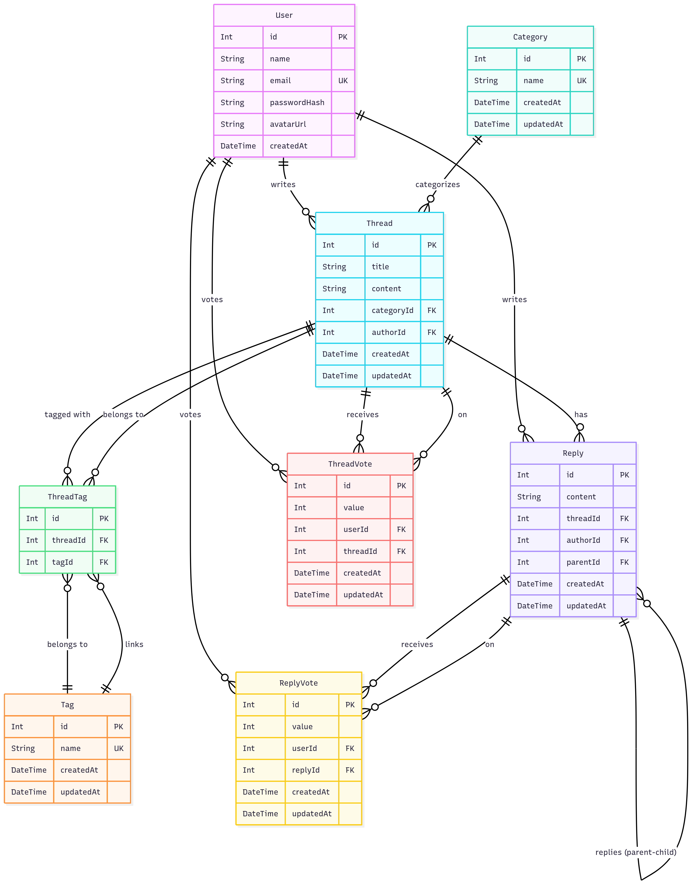

# United Minds – Online Forum & Discussion Board

**United Minds** is a full-stack community-driven platform inspired by Reddit and Stack Overflow.  
It allows users to create threads, reply with nested comments, upvote/downvote posts, and organize discussions using categories and tags.  

The goal of the project is to provide a **secure, interactive, and structured environment** for students and tech enthusiasts to share knowledge, solve problems, and collaborate.

---

## 🚀 Features

- **User Authentication & Security**
  - Register and login with JWT-based authentication
  - Passwords securely hashed with bcrypt

- **Categories & Tags**
  - Organize threads into categories
  - Assign multiple tags to threads for easy discovery

- **Thread Management**
  - Create and manage threads with title, content, category, and tags
  - View detailed thread pages with replies and votes

- **Replies with Nesting**
  - Reply directly to a thread or to another reply
  - Supports hierarchical conversation structures

- **Voting System**
  - Upvote and downvote threads and replies
  - Toggle-based voting with one vote per user per item

---

## 🛠️ Tech Stack

### Frontend
- React.js  
- React Router  
- Axios  
- Context API / Redux  
- Tailwind CSS  
- **Hosted on Netlify**

### Backend
- Node.js + Express.js  
- Prisma ORM  
- PostgreSQL (**Neon DB**)  
- Passport.js with JWT  
- bcrypt.js for password hashing  
- **Hosted on Render**

### Tools & Utilities
- Postman (API Testing)  
- Git & GitHub (Version Control)  
- dotenv (Environment Management)  
- CORS Middleware  
- VS Code (Development Environment)

---

## 🗂️ Database Schema

The database is structured to support users, threads, replies, votes, tags, and categories.  

- **Users** – Stores user information and authentication data  
- **Threads** – Discussion posts with title, content, category, and tags  
- **Replies** – Linked to threads and other replies for nested structure  
- **Votes** – Tracks user upvotes/downvotes for threads and replies  
- **Tags** – Keywords for content discovery  
- **Categories** – Groups threads into broader topics  
- **ThreadTags** – Join table linking threads and tags  

### ER Diagram  
*(Insert ER diagram image here)*  


---

## ⚙️ Setup Instructions

### 1. Clone Repository
```bash
git clone https://github.com/itsrudra143/United-Minds.git
cd United-Minds
